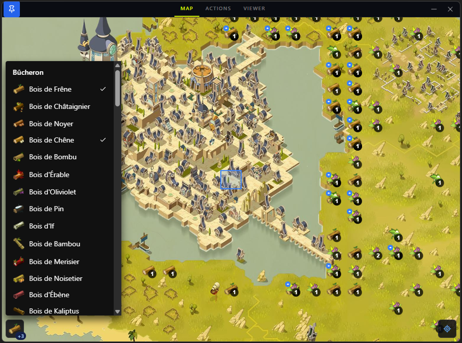

# dofus3-gatherer



Windows overlay for Dofus 3 that sniffs game packets and shows resource/character positions on a live map.

## Features

- **Interactive map** — resource markers and character position updated in real time
- **Resource filter** — toggle resource types from the side panel
- **Quick Actions** — send keystrokes (harvest hotkey, `/travel`) directly to the game window
- **Packet Viewer** — screen-record sessions with a synced packet timeline for debugging protocol mappings
- **Config modal** — map obfuscated packet field names to known keys

## Prerequisites

- **Windows** only
- **Npcap** — installed automatically on first launch if missing

## Development

```bash
pnpm install

# Rebuild native addons after install
npx @electron/rebuild -f -w keysender

pnpm dev
```

## Build

```bash
pnpm build  # outputs portable .exe to dist/
```

## Configuration

Settings are saved to `%APPDATA%/Dofus3 Gatherer/config/config.json`.

Use the **Config** button (bottom-left of the map) to map obfuscated packet field names (e.g. `CurrentMapMessage` → `"isj"`). When the game updates and names change, use the **Packet Viewer** to find the new ones.
